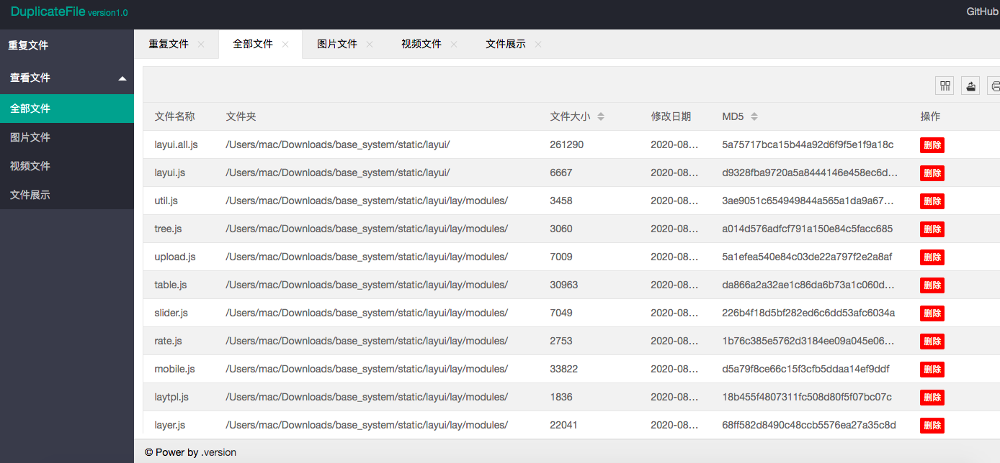

> 开始： 
>
> 修改app/db/mysql下数据库配置
>
> 初次执行 go run main.go -n -p /home/src
>
> 再次执行 go run main.go

> -n 执行新任务 
> -p 检测路径
>
> 如果不需要检测md 请加上 -md false

> 初次执行会先扫描文件并检查重复文件，这个步骤耗时比较长，执行完后 可以在浏览器 http://localhost:8000 查看

> 没有安装golang环境的，可以在命令行执行二进制文件，首次执行要追加-n -p指令，会在目录下生成views网页文件夹以及static js文件夹。

> runtime文件夹保存日志及levelDB数据文件

> 测试环境 darwin10.15.5  

